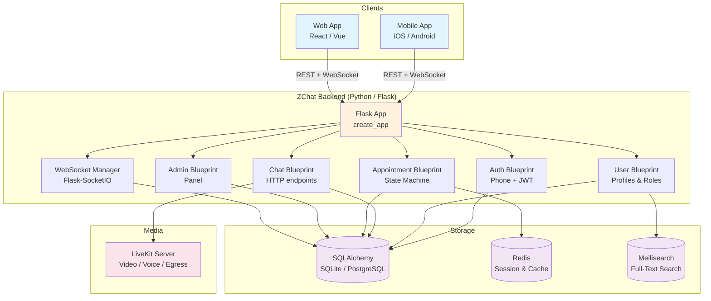

# ZChat — Career Mentoring Marketplace Backend

[](https://github.com/jsyqrt/chat_server/actions/workflows/ci.yml)

A production-grade **real-time communication backend** for a career mentoring marketplace. The platform connects **career mentees (newbies)** with **industry experts** for one-on-one mentoring sessions. Built with Flask, this backend powers phone-based authentication, instant messaging, video/voice calls via LiveKit, appointment booking with a formal state machine, full-text search via Meilisearch, and a balanced payment system.



## Features

- **📱 Phone Authentication** — Login via SMS verification code with JWT session management
- **💬 Real-Time Chat** — Instant messaging with unread counts, read receipts, and offline message queuing (Flask-SocketIO)
- **🎥 Video & Voice Calls** — WebRTC-based calls powered by LiveKit, including room management and egress recording
- **📅 Appointment Booking** — Formal state machine: `Created → Confirmed → Paid → Delivered → Commented → Finished` with dispute handling
- **👤 User Profiles & Roles** — Dual-role system (Expert / Newbie) with profile editing, avatar upload, and search indexing
- **🔍 Full-Text Search** — Meilisearch integration for discovering experts and mentees by company, profession, skills, and more
- **💰 Balance & Payments** — Internal wallet with deposit, transfer (platform commission), withdrawal, and refund logic
- **🛡️ Admin Panel** — User verification, appointment oversight, dispute resolution, and platform statistics

## Tech Stack

| Technology        | Purpose                               | Version   |
|-------------------|---------------------------------------|-----------|
| Python            | Programming language                  | ≥ 3.11    |
| Flask             | Web framework                         | 3.0.x     |
| Flask-SQLAlchemy  | ORM & database                        | 3.1.x     |
| Flask-SocketIO    | WebSocket / real-time messaging       | 5.3.x     |
| Flask-Login       | Session-based auth                    | 0.6.x     |
| Flask-Migrate     | Database migrations (Alembic)          | 4.0.x     |
| SQLAlchemy        | SQL toolkit                           | 2.0.x     |
| LiveKit API       | Video / voice / egress                | 0.5.x     |
| Meilisearch       | Full-text search engine               | 0.31.x    |
| Redis             | (Optional) caching & pub/sub          | —         |
| PyJWT             | JSON Web Token authentication         | 2.8.x     |
| pytest            | Testing framework                     | ≥ 7       |

## Quick Start

### Prerequisites

- Python ≥ 3.11
- (Optional) A running [Meilisearch](https://www.meilisearch.com/) instance for full-text search
- (Optional) A running [LiveKit](https://livekit.io/) server for video/voice calls

### Setup

```bash
# 1. Clone the repository
git clone https://github.com/USERNAME/REPO.git
cd REPO

# 2. Create and activate a virtual environment
python -m venv venv
source venv/bin/activate   # Windows: venv\Scripts\activate

# 3. Install dependencies
pip install -r requirements.txt

# 4. Initialize the database
flask --app zchat init-db

# 5. Generate sample data (optional)
curl -v -X GET "http://127.0.0.1:5000/user/gen_random?count=200"

# 6. Run the development server
flask --app zchat run
```

The server starts at `http://127.0.0.1:5000`.

### Database Migrations

```bash
flask --app zchat migrate init          # (one-time) initialize Alembic
flask --app zchat migrate migrate -m "description"
flask --app zchat migrate upgrade
```

## API Endpoints

### Authentication (`/auth/`)

| Method | Endpoint                | Description                        |
|--------|-------------------------|------------------------------------|
| GET    | `/auth/verification_code` | Request a 6-digit SMS code        |
| GET    | `/auth/login`           | Log in with phone + code → JWT     |
| GET    | `/auth/logout`          | Log out and disconnect WebSocket   |
| GET    | `/auth/protected`       | Test endpoint (requires auth)      |

### Users (`/user/`)

| Method | Endpoint                      | Description                        |
|--------|-------------------------------|------------------------------------|
| GET    | `/user/me`                    | Get current user's full profile    |
| GET    | `/user/all`                   | List all users (auth required)     |
| GET    | `/user/avatar?id=`            | Get a user's avatar URL            |
| POST   | `/user/update_nickname`       | Update display name                |
| POST   | `/user/update_avatar`         | Upload avatar image                |
| POST   | `/user/update_info`           | Update phone, nickname, gender...  |
| POST   | `/user/register_expert`       | Register as an Expert              |
| GET    | `/user/expert?id=`            | Get expert profile by user ID      |
| GET    | `/user/newbie?id=`            | Get newbie profile by user ID      |
| GET    | `/user/my_experts`            | Recommended experts for newbie     |
| GET    | `/user/my_newbies`            | Recommended newbies for expert     |
| GET    | `/user/chatlist`              | Get user's chat partners           |
| GET    | `/user/is_admin`              | Check if current user is admin     |
| GET    | `/user/gen_random?count=N`    | Generate N random users (dev)      |

### Appointments (`/appointment/`)

| Method | Endpoint                        | Description                          |
|--------|---------------------------------|--------------------------------------|
| POST   | `/appointment/new`              | Create an appointment (stage: Created)|
| POST   | `/appointment/confirm`          | Expert confirms (→ Confirmed)        |
| POST   | `/appointment/pay`              | Newbie pays (→ Paid)                 |
| POST   | `/appointment/deliver`          | Platform delivers recording (→ Delivered)|
| POST   | `/appointment/comment`          | Newbie leaves review (→ Commented)   |
| POST   | `/appointment/dispute`          | Newbie disputes (→ Disputed)         |
| POST   | `/appointment/handle_dispute`   | Admin resolves dispute               |
| POST   | `/appointment/cancel`           | Newbie cancels (→ Canceled)          |
| POST   | `/appointment/finish`           | Platform finalizes (→ Finished)      |
| GET    | `/appointment/`                 | Get an appointment by ID             |
| GET    | `/appointment/mine`             | Get all appointments for current user|
| GET    | `/appointment/as_expert`        | Appointments where user is expert    |
| GET    | `/appointment/as_newbie`        | Appointments where user is newbie    |
| GET    | `/appointment/balance`          | Get current user's wallet balance    |
| GET    | `/appointment/comments_of`      | Get reviews for an expert            |

### Chat (`/chat/`)

| Method | Endpoint                | Description                        |
|--------|-------------------------|------------------------------------|
| GET    | `/chat/test`            | Render a chat test page (HTML)     |
| GET    | `/chat/call_records`    | Get call records for an appointment |
| GET    | `/chat/get_token`       | Get LiveKit token for video/voice   |

### WebSocket Events (Flask-SocketIO)

| Event              | Direction       | Description                        |
|--------------------|-----------------|------------------------------------|
| `send_message`     | Client→Server   | Send a text message to another user|
| `mark_as_read`     | Client→Server   | Mark messages as read up to a timestamp |
| `get_messages`     | Client→Server   | Request paginated message history  |
| `makeCall`         | Client→Server   | Initiate a WebRTC call              |
| `acceptCall`       | Client→Server   | Accept an incoming call             |
| `leaveCall`        | Client→Server   | End / reject a call                 |
| `msg`              | Server→Client   | Deliver a message to recipient      |
| `update_chatlist`  | Server→Client   | Notify of new conversation          |
| `latest_read_time` | Server→Client   | Notify sender that msgs were read   |
| `newCall`          | Server→Client   | Notify callee of incoming call      |
| `callLeaved`       | Server→Client   | Notify peer that call ended         |

### Admin (`/admin/`)

| Method | Endpoint                                | Description                        |
|--------|-----------------------------------------|------------------------------------|
| GET    | `/admin/stats`                          | Platform statistics                 |
| GET    | `/admin/experts_waiting_for_email_verified` | Unverified experts list        |
| GET    | `/admin/experts_waiting_for_human_verified` | Manual-review experts list     |
| POST   | `/admin/experts_set_human_verified`      | Approve an expert manually          |
| GET    | `/admin/appointments_waiting_finish`     | Appointments ready to finalize      |
| POST   | `/admin/appointments_finish_one`         | Finalize an appointment              |
| GET    | `/admin/notify_upgrade_app`              | Push upgrade notification to users   |

## Project Structure

```
.
├── .github/workflows/ci.yml      # CI pipeline
├── zchat/                         # Application package
│   ├── __init__.py                # App factory (create_app)
│   ├── admin.py                   # Admin panel blueprint
│   ├── appointment.py             # Appointment booking blueprint
│   ├── auth.py                    # Phone auth + JWT blueprint
│   ├── avatar.py                  # Static file serving + caching
│   ├── chat.py                    # Chat HTTP & LiveKit endpoints
│   ├── db.py                      # SQLAlchemy + Flask-Migrate setup
│   ├── meili.py                   # Meilisearch client + indexing
│   ├── models.py                  # All ORM models + business logic
│   ├── rand.py                    # Random data generators (dev)
│   ├── user.py                    # User profiles blueprint
│   ├── websocket.py               # SocketIO initialization
│   ├── schema.sql                 # Legacy schema reference
│   ├── static/images/             # Avatar / uploaded images
│   └── templates/                 # Jinja2 templates
├── tests/                         # Test suite
│   ├── __init__.py
│   ├── conftest.py                # Fixtures (app, client)
│   ├── test_auth.py               # Phone auth flow tests
│   ├── test_chat.py               # WebSocket messaging tests
│   └── test_models.py             # State machine & model tests
├── requirements.txt               # Python dependencies
├── launch.sh                      # Production launch script
├── stop.sh                        # Production stop script
└── README.md                      # This file
```

## Testing

Tests use **pytest** with an in-memory SQLite database and mocked external services.

```bash
# Install test dependencies
pip install -r requirements.txt
pip install pytest pytest-flask

# Run all tests
python -m pytest tests/ -v

# Run specific test file
python -m pytest tests/test_models.py -v

# Run with coverage
pip install pytest-cov
python -m pytest tests/ --cov=zchat --cov-report=term-missing -v
```

### What Is Tested

| Test File        | Coverage                                                  |
|------------------|-----------------------------------------------------------|
| `test_auth.py`   | Verification code request, successful login, wrong code, rate limiting, protected endpoints |
| `test_models.py` | Appointment state machine (all 9 stage transitions), dispute flow, user CRUD, balance deposit/transfer/withdraw |
| `test_chat.py`   | SocketIO connect/disconnect, message send/receive, offline queuing, read receipts, call signalling |

## Architecture Overview

### Appointment State Machine

```
                         ┌─────────┐
            ┌────────────│ Created  │◄────────────┐
            │            └────┬─────┘             │
            │                 │ expert confirms    │
            │                 ▼                    │
            │            ┌──────────┐             │
            │            │ Confirmed│             │
            │            └────┬─────┘             │
            │                 │ newbie pays        │
            │                 ▼                    │
            │            ┌──────────┐             │
            │            │  Paied   │             │
            │            └────┬─────┘             │
            │                 │ platform delivers  │
            │                 ▼                    │
            │            ┌──────────┐             │
            │            │ Delivered│             │
            │            └────┬─────┘             │
            │                 │ newbie comments    │
            │                 ▼                    │
            │    ┌──────────────────────┐          │
            │    │     Commented        │          │
            │    └──┬────────────┬──────┘          │
            │       │ dispute    │ auto-finalize   │
            │       ▼            ▼                  │
            │  ┌──────────┐  ┌──────────┐          │
            │  │ Disputed │  │ Finished │          │
            │  └────┬─────┘  └──────────┘          │
            │       │ admin handles                  │
            │       ▼                                │
            │  ┌──────────────┐                      │
            │  │DisputeHandled│                      │
            │  └──────┬───────┘                      │
            │         │ platform finalizes            │
            └─────────▼                               │
                  ┌──────────┐                        │
                  │ Finished │                        │
                  └──────────┘                        │
                  ▲                                   │
                  │  newbie cancels                   │
                  │  (from Created/Confirmed/Paied)    │
                  │  before appointment time           │
                  └───────────────────────────────────┘

                  ┌──────────┐
                  │ Canceled │
                  └──────────┘
```

### Data Flow

1. **User authenticates** via phone → gets JWT + session cookie
2. **Expert is discovered** via Meilisearch full-text search
3. **Appointment is created** by the newbie with a proposed time
4. **Expert confirms** → appointment enters `Confirmed` state
5. **Newbie pays** → funds are deposited + transferred into locked escrow
6. **Video/voice call** happens over LiveKit (WebRTC), recorded via egress
7. **Platform delivers** the recording → `Delivered` state
8. **Newbie reviews** → `Commented` state (or `Disputed` if unsatisfied)
9. **Platform finalizes** → expert is paid (minus commission), flow complete

## License

[MIT](LICENSE) — feel free to use this project for commercial or personal purposes.
